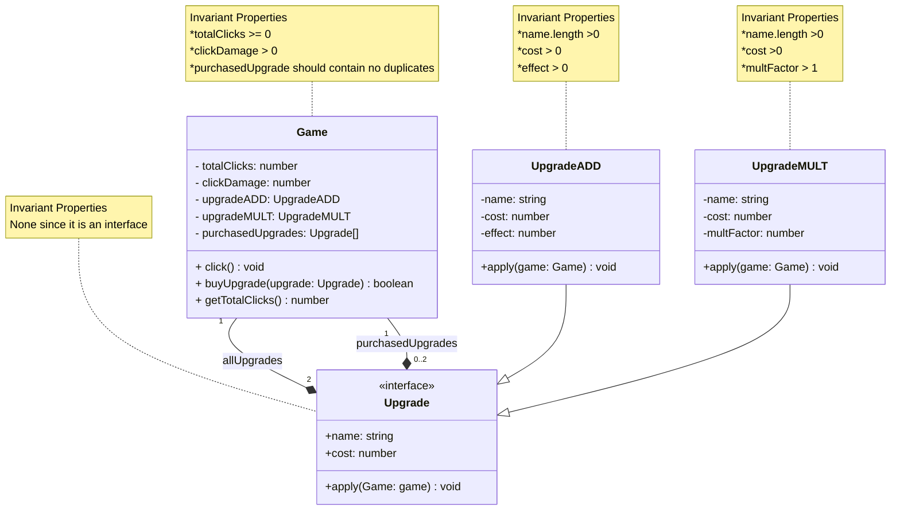

----
title: Domain Model for my clicker project
author: Mahmudl (mahmudl@myuamnitoba.ca)
date: Winter 2026
---

# Domain Model

```mermaid
classDiagram
    class Game{
        %% Assuming getters and constructors are placed
        - totalClicks: number
        - clickDamage: number
        - upgradeADD: UpgradeADD
        - upgradeMULT: UpgradeMULT
        - purchasedUpgrades: Upgrade[]
        + click() void
        %%Implements the upgrade, increases clicks and spends clicks
        %%calls Upgrade apply
        + buyUpgrade(upgrade: Upgrade) boolean
        + getTotalClicks() number
    }
    note for Game "Invariant Properties
                    *totalClicks >= 0
                    *clickDamage > 0
                    *purchasedUpgrade should contain no duplicates"
    
    class Upgrade{
       <<interface>>
       +name: string
       +cost: number
       +apply(Game: game) void
    }
    
    note for Upgrade "Invariant Properties
                      None since it is an interface"
    
    class UpgradeADD{
        -name: string
        -cost: number
        -effect: number
        +apply(game: Game) void
    }
    
    note for UpgradeADD "Invariant Properties
                         *name.length >0
                         *cost > 0
                         *effect > 0
                        "       
    
    class UpgradeMULT{
        -name: string
        -cost: number
        -multFactor: number
        +apply(game: Game) void
    }
    
    note for UpgradeMULT "Invariant Properties
                          *name.length >0
                          *cost >0 
                          *multFactor > 1
                          "
    
 %%Cardinality composition
    Game "1" --* "2" Upgrade: allUpgrades
    Game "1" --* "0..2" Upgrade: purchasedUpgrades
     
%% Implements
    UpgradeADD --|> Upgrade
    UpgradeMULT --|> Upgrade
    
    
```
