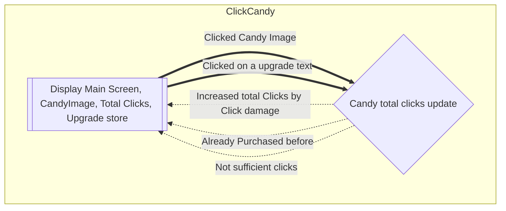

----
title: Flows of interaction for my clicker project
author: Mahmudl (mahmudl@myuamnitoba.ca)
date: Winter 2026
---

# Flows of interaction

```mermaid
flowchart 
    subgraph ClickCandy 
        DisplayMain[[Display Main Screen, CandyImage, Total Clicks, Upgrade store]]
        
        UpdateDisplay{Candy total clicks update}
        DisplayMain==Clicked Candy Image==>UpdateDisplay
        UpdateDisplay-.Increased total Clicks by Click damage.->DisplayMain
        
        DisplayMain==Clicked on a upgrade text==>UpdateDisplay
        UpdateDisplay-.Already Purchased before.->DisplayMain
        UpdateDisplay-.Not sufficient clicks.->DisplayMain
    end
```